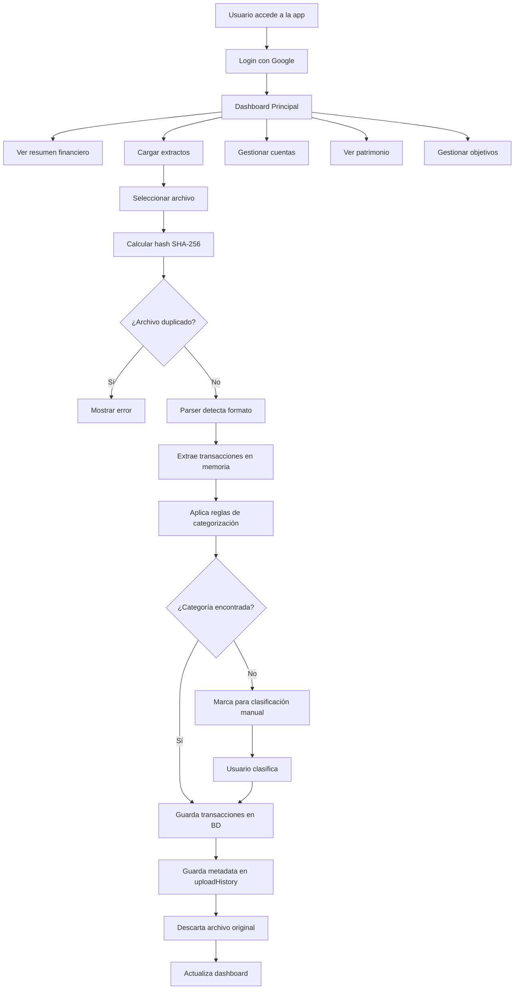

# Plan Detallado: App de Gestión de Finanzas Familiares

## 📋 Resumen del Proyecto

Aplicación web para gestionar finanzas familiares con múltiples cuentas bancarias y tarjetas de crédito, desplegable en GitHub Pages con integración Firebase.

## 🎯 Características Principales

1. **Autenticación**: Login con Google (Firebase Auth)
2. **Gestión de Cuentas**: Múltiples bancos y tarjetas
3. **Carga de Extractos**: PDF, CSV y Excel (procesamiento en memoria, sin almacenamiento)
4. **Categorización**: Sistema basado en reglas + manual
5. **Dashboard**: KPIs y análisis financiero
6. **Patrimonio**: Gestión de activos familiares
7. **Objetivos**: Seguimiento de metas financieras

## 🏗️ Arquitectura Técnica

### Stack Tecnológico

```
Frontend:
- React 18 (con Vite para build rápido)
- TypeScript
- Tailwind CSS (diseño responsive)
- Chart.js / Recharts (gráficos)
- React Router (navegación)

Backend/Servicios:
- Firebase Authentication (Google OAuth)
- Firebase Realtime Database

Librerías Adicionales:
- Papa Parse (CSV parsing)
- XLSX (Excel parsing)
- PDF.js (PDF parsing)
- date-fns (manejo de fechas)
- React Hook Form (formularios)
- crypto (Web Crypto API para hash de archivos)
```

## 📊 Modelo de Datos

### Estructura Firebase Realtime Database

```javascript
{
  "users": {
    "userId": {
      "email": "user@example.com",
      "displayName": "Usuario",
      "photoURL": "url",
      "createdAt": "timestamp"
    }
  },
  
  "accounts": {
    "userId": {
      "accountId": {
        "name": "BROU Pesos",
        "type": "debit|credit",
        "currency": "UYU|USD",
        "bank": "BROU",
        "owner": "Yosba|Yane|Ambos",
        "balance": 0,
        "creditLimit": 0,
        "lastSync": "timestamp"
      }
    }
  },
  
  "transactions": {
    "userId": {
      "transactionId": {
        "accountId": "ref",
        "date": "timestamp",
        "description": "Descripción",
        "amount": 0,
        "currency": "UYU|USD",
        "type": "income|expense",
        "category": "categoryId",
        "subcategory": "subcategoryId",
        "isRecurring": false,
        "notes": "",
        "status": "pending|classified|verified",
        "uploadId": "ref",
        "createdAt": "timestamp"
      }
    }
  },
  
  "uploadHistory": {
    "userId": {
      "uploadId": {
        "fileName": "extracto_brou_enero_2024.pdf",
        "fileHash": "sha256_hash_del_archivo",
        "uploadedBy": "userId",
        "uploadDate": "timestamp",
        "accountId": "ref",
        "transactionsCount": 45,
        "status": "processed|error",
        "errorMessage": ""
      }
    }
  },
  
  "categories": {
    "userId": {
      "categoryId": {
        "name": "Alimentación",
        "icon": "🍔",
        "color": "#FF6B6B",
        "type": "expense|income",
        "keywords": ["supermercado", "tienda", "almacén"],
        "subcategories": {
          "subcategoryId": {
            "name": "Supermercado",
            "keywords": ["disco", "devoto", "tienda inglesa"]
          }
        }
      }
    }
  },
  
  "assets": {
    "userId": {
      "assetId": {
        "name": "Casa Habana",
        "type": "property|vehicle|investment|other",
        "value": 0,
        "currency": "USD",
        "purchaseDate": "timestamp",
        "description": "",
        "location": "",
        "images": ["url1", "url2"]
      }
    }
  },
  
  "goals": {
    "userId": {
      "goalId": {
        "name": "Comprar Casa",
        "targetAmount": 100000,
        "currentAmount": 0,
        "currency": "USD",
        "deadline": "timestamp",
        "status": "active|completed|cancelled",
        "createdAt": "timestamp"
      }
    }
  },
  
  "rules": {
    "userId": {
      "ruleId": {
        "keyword": "uber",
        "categoryId": "ref",
        "subcategoryId": "ref",
        "priority": 1
      }
    }
  }
}
```

## 🎨 Estructura de Componentes

```
src/
├── components/
│   ├── auth/
│   │   ├── LoginPage.tsx
│   │   └── ProtectedRoute.tsx
│   ├── layout/
│   │   ├── Header.tsx
│   │   ├── Sidebar.tsx
│   │   └── Layout.tsx
│   ├── dashboard/
│   │   ├── Dashboard.tsx
│   │   ├── KPICard.tsx
│   │   ├── IncomeExpenseChart.tsx
│   │   ├── CategoryPieChart.tsx
│   │   └── MonthlyTrendChart.tsx
│   ├── accounts/
│   │   ├── AccountsList.tsx
│   │   ├── AccountCard.tsx
│   │   ├── AddAccountModal.tsx
│   │   └── AccountDetails.tsx
│   ├── transactions/
│   │   ├── TransactionsList.tsx
│   │   ├── TransactionRow.tsx
│   │   ├── UploadStatements.tsx
│   │   ├── ClassifyTransactions.tsx
│   │   ├── UploadHistory.tsx
│   │   └── TransactionFilters.tsx
│   ├── categories/
│   │   ├── CategoriesManager.tsx
│   │   ├── CategoryCard.tsx
│   │   └── AddCategoryModal.tsx
│   ├── assets/
│   │   ├── AssetsList.tsx
│   │   ├── AssetCard.tsx
│   │   └── AddAssetModal.tsx
│   ├── goals/
│   │   ├── GoalsList.tsx
│   │   ├── GoalCard.tsx
│   │   ├── GoalProgress.tsx
│   │   └── AddGoalModal.tsx
│   └── common/
│       ├── Button.tsx
│       ├── Modal.tsx
│       ├── LoadingSpinner.tsx
│       └── ErrorBoundary.tsx
├── services/
│   ├── firebase.ts
│   ├── auth.service.ts
│   ├── accounts.service.ts
│   ├── transactions.service.ts
│   ├── categories.service.ts
│   ├── assets.service.ts
│   ├── goals.service.ts
│   └── uploadHistory.service.ts
├── parsers/
│   ├── pdfParser.ts
│   ├── csvParser.ts
│   ├── excelParser.ts
│   ├── fileHasher.ts
│   └── bankParsers/
│       ├── brouParser.ts
│       ├── itauParser.ts
│       ├── santanderParser.ts
│       ├── ocaParser.ts
│       └── prexParser.ts
├── utils/
│   ├── categorization.ts
│   ├── currency.ts
│   ├── dateHelpers.ts
│   └── calculations.ts
├── hooks/
│   ├── useAuth.ts
│   ├── useAccounts.ts
│   ├── useTransactions.ts
│   └── useCategories.ts
├── types/
│   └── index.ts
├── App.tsx
└── main.tsx
```

## 🔄 Flujo de Trabajo



## 📱 Páginas y Rutas

```typescript
/                          → Dashboard principal
/login                     → Página de login
/accounts                  → Lista de cuentas
/accounts/:id              → Detalle de cuenta
/transactions              → Lista de transacciones
/transactions/upload       → Cargar extractos
/transactions/classify     → Clasificar transacciones
/transactions/history      → Historial de cargas
/categories                → Gestión de categorías
/assets                    → Gestión de patrimonio
/goals                     → Objetivos financieros
/reports                   → Reportes y análisis
/settings                  → Configuración
```

## 📊 KPIs del Dashboard

### Tarjetas Principales
1. **Balance Total** (en UYU y USD)
2. **Ingresos del Mes**
3. **Gastos del Mes**
4. **Ahorro del Mes** (Ingresos - Gastos)
5. **Deuda Total en Tarjetas de Crédito**
6. **Patrimonio Neto**

### Gráficos
1. **Tendencia Mensual**: Ingresos vs Gastos (últimos 12 meses)
2. **Distribución por Categorías**: Pie chart de gastos
3. **Gastos por Cuenta**: Bar chart comparativo
4. **Evolución del Patrimonio**: Line chart
5. **Progreso de Objetivos**: Progress bars

## 🏦 Cuentas Iniciales a Configurar

```javascript
const initialAccounts = [
  // Yosba
  { name: "BROU Pesos", type: "debit", currency: "UYU", bank: "BROU", owner: "Yosba" },
  { name: "BROU Dólares", type: "debit", currency: "USD", bank: "BROU", owner: "Yosba" },
  { name: "Itaú Pesos", type: "debit", currency: "UYU", bank: "Itaú", owner: "Yosba" },
  { name: "Itaú Dólares", type: "debit", currency: "USD", bank: "Itaú", owner: "Yosba" },
  { name: "Itaú Visa", type: "credit", currency: "UYU", bank: "Itaú", owner: "Yosba" },
  { name: "OCA Master 1", type: "credit", currency: "UYU", bank: "OCA", owner: "Yosba" },
  { name: "OCA Visa", type: "credit", currency: "UYU", bank: "OCA", owner: "Yosba" },
  { name: "Prex Pesos", type: "debit", currency: "UYU", bank: "Prex", owner: "Yosba" },
  { name: "Prex Dólares", type: "debit", currency: "USD", bank: "Prex", owner: "Yosba" },
  
  // Yane
  { name: "Santander Pesos", type: "debit", currency: "UYU", bank: "Santander", owner: "Yane" },
  { name: "Santander Dólares", type: "debit", currency: "USD", bank: "Santander", owner: "Yane" },
  { name: "Santander Visa", type: "credit", currency: "UYU", bank: "Santander", owner: "Yane" },
  { name: "OCA Master 2", type: "credit", currency: "UYU", bank: "OCA", owner: "Yane" },
  
  // Ambos
  { name: "BHU Conjunto", type: "debit", currency: "UYU", bank: "BHU", owner: "Ambos" },
  { name: "IBM Inversiones", type: "investment", currency: "USD", bank: "IBM", owner: "Yosba" }
];
```

## 🏷️ Categorías Iniciales

```javascript
const defaultCategories = [
  {
    name: "Ingresos",
    type: "income",
    icon: "💰",
    color: "#10B981",
    subcategories: ["Salario", "Freelance", "Inversiones", "Otros"]
  },
  {
    name: "Alimentación",
    type: "expense",
    icon: "🍔",
    color: "#EF4444",
    keywords: ["supermercado", "tienda", "almacén", "disco", "devoto"],
    subcategories: ["Supermercado", "Restaurantes", "Delivery"]
  },
  {
    name: "Transporte",
    type: "expense",
    icon: "🚗",
    color: "#3B82F6",
    keywords: ["uber", "taxi", "combustible", "nafta", "gasoil", "estacionamiento"],
    subcategories: ["Combustible", "Uber/Taxi", "Mantenimiento", "Estacionamiento"]
  },
  {
    name: "Servicios",
    type: "expense",
    icon: "💡",
    color: "#F59E0B",
    keywords: ["ute", "ose", "antel", "internet", "cable"],
    subcategories: ["Electricidad", "Agua", "Internet", "Teléfono", "Cable"]
  },
  {
    name: "Vivienda",
    type: "expense",
    icon: "🏠",
    color: "#8B5CF6",
    keywords: ["alquiler", "bhu", "hipoteca", "contribución"],
    subcategories: ["Alquiler/Hipoteca", "Mantenimiento", "Contribución", "Seguros"]
  },
  {
    name: "Salud",
    type: "expense",
    icon: "⚕️",
    color: "#EC4899",
    keywords: ["farmacia", "médico", "mutualista", "seguro"],
    subcategories: ["Mutualista", "Farmacia", "Médicos", "Seguros"]
  },
  {
    name: "Entretenimiento",
    type: "expense",
    icon: "🎬",
    color: "#14B8A6",
    keywords: ["netflix", "spotify", "cine", "teatro"],
    subcategories: ["Streaming", "Cine", "Eventos", "Hobbies"]
  },
  {
    name: "Educación",
    type: "expense",
    icon: "📚",
    color: "#6366F1",
    keywords: ["curso", "libro", "universidad", "colegio"],
    subcategories: ["Cursos", "Libros", "Matrícula"]
  },
  {
    name: "Compras",
    type: "expense",
    icon: "🛍️",
    color: "#F97316",
    keywords: ["ropa", "zapatos", "mercadolibre"],
    subcategories: ["Ropa", "Electrónica", "Hogar", "Otros"]
  },
  {
    name: "Otros Gastos",
    type: "expense",
    icon: "📦",
    color: "#64748B",
    subcategories: ["Varios"]
  }
];
```

## 🔧 Configuración Firebase

### firebase.config.ts
```typescript
const firebaseConfig = {
  apiKey: "YOUR_API_KEY",
  authDomain: "finance-family-tp.firebaseapp.com",
  databaseURL: "https://finance-family-tp-default-rtdb.firebaseio.com",
  projectId: "finance-family-tp",
  storageBucket: "finance-family-tp.appspot.com",
  messagingSenderId: "YOUR_SENDER_ID",
  appId: "YOUR_APP_ID"
};
```

### Reglas de Seguridad Firebase

```json
{
  "rules": {
    "users": {
      "$uid": {
        ".read": "$uid === auth.uid",
        ".write": "$uid === auth.uid"
      }
    },
    "accounts": {
      "$uid": {
        ".read": "$uid === auth.uid",
        ".write": "$uid === auth.uid"
      }
    },
    "transactions": {
      "$uid": {
        ".read": "$uid === auth.uid",
        ".write": "$uid === auth.uid"
      }
    },
    "uploadHistory": {
      "$uid": {
        ".read": "$uid === auth.uid",
        ".write": "$uid === auth.uid"
      }
    },
    "categories": {
      "$uid": {
        ".read": "$uid === auth.uid",
        ".write": "$uid === auth.uid"
      }
    },
    "assets": {
      "$uid": {
        ".read": "$uid === auth.uid",
        ".write": "$uid === auth.uid"
      }
    },
    "goals": {
      "$uid": {
        ".read": "$uid === auth.uid",
        ".write": "$uid === auth.uid"
      }
    }
  }
}
```

## 📦 Parsers de Extractos Bancarios

### Estrategia de Parsing

**IMPORTANTE**: Los archivos NO se guardan. Solo se procesan en memoria del navegador.

1. **Lectura en Memoria**: El archivo se lee completamente en el navegador
2. **Cálculo de Hash**: Se genera un hash SHA-256 del archivo para detectar duplicados
3. **Verificación de Duplicados**: Se consulta uploadHistory para evitar cargas repetidas
4. **Detección Automática**: Identificar banco por patrones en el archivo
5. **Extracción de Datos**: Fecha, descripción, monto, moneda
6. **Normalización**: Formato estándar para todas las transacciones
7. **Validación**: Verificar datos extraídos
8. **Registro de Metadata**: Guardar información de la carga (nombre, hash, fecha, usuario, cantidad de transacciones)
9. **Descarte del Archivo**: El archivo original no se almacena, solo las transacciones extraídas

### Ejemplo: Parser BROU

```typescript
interface ParsedTransaction {
  date: Date;
  description: string;
  amount: number;
  currency: string;
  type: 'income' | 'expense';
}

interface UploadMetadata {
  fileName: string;
  fileHash: string;
  uploadedBy: string;
  uploadDate: Date;
  accountId: string;
  transactionsCount: number;
  status: 'processed' | 'error';
  errorMessage?: string;
}

async function parseBROUStatement(file: File, accountId: string): Promise<ParsedTransaction[]> {
  // 1. Calcular hash del archivo para detectar duplicados
  const fileHash = await calculateFileHash(file);
  
  // 2. Verificar si ya fue procesado
  const isDuplicate = await checkDuplicateUpload(fileHash);
  if (isDuplicate) {
    throw new Error('Este archivo ya fue cargado anteriormente');
  }
  
  // 3. Leer archivo en memoria (no se guarda)
  const fileContent = await readFileContent(file);
  
  // 4. Detectar formato (PDF/CSV) y extraer transacciones
  const transactions = await extractTransactions(fileContent);
  
  // 5. Registrar metadata de la carga
  await saveUploadHistory({
    fileName: file.name,
    fileHash: fileHash,
    uploadedBy: currentUserId,
    uploadDate: new Date(),
    accountId: accountId,
    transactionsCount: transactions.length,
    status: 'processed'
  });
  
  // 6. Retornar transacciones (el archivo original se descarta)
  return transactions;
}

// Función para calcular hash SHA-256 usando Web Crypto API
async function calculateFileHash(file: File): Promise<string> {
  const buffer = await file.arrayBuffer();
  const hashBuffer = await crypto.subtle.digest('SHA-256', buffer);
  const hashArray = Array.from(new Uint8Array(hashBuffer));
  return hashArray.map(b => b.toString(16).padStart(2, '0')).join('');
}

// Función para verificar duplicados
async function checkDuplicateUpload(fileHash: string): Promise<boolean> {
  const uploadHistoryRef = ref(database, `uploadHistory/${currentUserId}`);
  const snapshot = await get(uploadHistoryRef);
  
  if (snapshot.exists()) {
    const uploads = snapshot.val();
    return Object.values(uploads).some((upload: any) => upload.fileHash === fileHash);
  }
  
  return false;
}
```

## 🎯 Sistema de Categorización

### Algoritmo de Reglas

```typescript
function categorizeTransaction(description: string, rules: Rule[]): Category | null {
  // 1. Normalizar descripción (lowercase, sin acentos)
  const normalized = normalizeText(description);
  
  // 2. Buscar coincidencias en reglas personalizadas (prioridad alta)
  const customMatch = findCustomRuleMatch(normalized, rules);
  if (customMatch) return customMatch;
  
  // 3. Buscar coincidencias en keywords de categorías
  const categoryMatch = findCategoryByKeywords(normalized);
  if (categoryMatch) return categoryMatch;
  
  // 4. Si no hay coincidencia, marcar para clasificación manual
  return null;
}
```

## 📈 Cálculos Financieros

### KPIs Principales

```typescript
// Balance total por moneda
function calculateTotalBalance(accounts: Account[]): { UYU: number, USD: number } {
  return accounts.reduce((acc, account) => {
    acc[account.currency] += account.balance;
    return acc;
  }, { UYU: 0, USD: 0 });
}

// Ingresos del mes
function calculateMonthlyIncome(transactions: Transaction[], month: number, year: number): number {
  return transactions
    .filter(t => t.type === 'income' && isInMonth(t.date, month, year))
    .reduce((sum, t) => sum + t.amount, 0);
}

// Gastos por categoría
function calculateExpensesByCategory(transactions: Transaction[]): Map<string, number> {
  return transactions
    .filter(t => t.type === 'expense')
    .reduce((map, t) => {
      const current = map.get(t.category) || 0;
      map.set(t.category, current + t.amount);
      return map;
    }, new Map());
}

// Patrimonio neto
function calculateNetWorth(assets: Asset[], debts: number): number {
  const totalAssets = assets.reduce((sum, asset) => sum + asset.value, 0);
  return totalAssets - debts;
}
```

## 🚀 Deployment en GitHub Pages

### Configuración

```json
// package.json
{
  "name": "finance-family-tp",
  "homepage": "https://[tu-usuario].github.io/finance-family-tp",
  "scripts": {
    "dev": "vite",
    "build": "tsc && vite build",
    "preview": "vite preview",
    "deploy": "npm run build && gh-pages -d dist"
  }
}
```

### GitHub Actions (opcional)

```yaml
# .github/workflows/deploy.yml
name: Deploy to GitHub Pages

on:
  push:
    branches: [ main ]

jobs:
  build-and-deploy:
    runs-on: ubuntu-latest
    steps:
      - uses: actions/checkout@v2
      - uses: actions/setup-node@v2
        with:
          node-version: '18'
      - run: npm ci
      - run: npm run build
      - uses: peaceiris/actions-gh-pages@v3
        with:
          github_token: ${{ secrets.GITHUB_TOKEN }}
          publish_dir: ./dist
```

## 🎨 Diseño UI/UX

### Paleta de Colores

```css
:root {
  --primary: #3B82F6;      /* Azul principal */
  --secondary: #10B981;    /* Verde éxito */
  --danger: #EF4444;       /* Rojo peligro */
  --warning: #F59E0B;      /* Amarillo advertencia */
  --dark: #1F2937;         /* Gris oscuro */
  --light: #F9FAFB;        /* Gris claro */
}
```

### Responsive Design

- **Mobile First**: Diseño optimizado para móviles
- **Breakpoints**: 640px (sm), 768px (md), 1024px (lg), 1280px (xl)
- **Touch Friendly**: Botones y áreas táctiles grandes

## 🔒 Seguridad

1. **Autenticación**: Solo usuarios autenticados pueden acceder
2. **Reglas Firebase**: Cada usuario solo ve sus datos
3. **Validación**: Validar datos en cliente y servidor
4. **HTTPS**: GitHub Pages usa HTTPS por defecto
5. **No exponer claves**: Variables de entorno para configuración
6. **Privacidad**: Los archivos no se almacenan, solo se procesan en memoria
7. **Detección de Duplicados**: Hash SHA-256 previene cargas repetidas

## 📝 Resumen de Tareas

1. Configurar estructura base del proyecto y GitHub Pages
2. Configurar Firebase (Authentication, Realtime Database)
3. Implementar autenticación con Google
4. Crear modelo de datos para cuentas bancarias y tarjetas
5. Desarrollar módulo de carga de archivos (PDF, CSV, Excel) con hash y detección de duplicados
6. Implementar parsers para extractos bancarios
7. Crear sistema de categorización basado en reglas
8. Desarrollar interfaz de clasificación manual de transacciones
9. Implementar historial de cargas con metadata
10. Implementar dashboard principal con KPIs financieros
11. Crear módulo de análisis de ingresos y gastos
12. Desarrollar sección de gestión de patrimonio
13. Implementar visualizaciones y gráficos
14. Crear módulo de objetivos financieros
15. Optimizar para dispositivos móviles
16. Realizar pruebas y deployment en GitHub Pages

## 🎯 Próximos Pasos

Una vez aprobado este plan, se procederá a la implementación en modo Code, comenzando por la configuración base del proyecto.